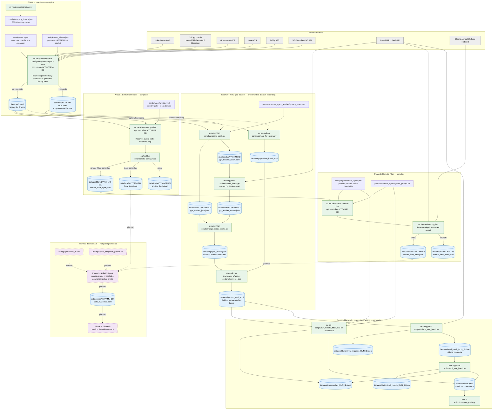

# Data Flow

_Last updated: 2026-05-19_

This diagram reflects the repository's current implemented data paths. Phase 3 and Phase 4 are shown as planned downstream targets but are not yet implemented.

## Notes

- PII scrubbing and deduplication (SHA-256 of company + title + location) happen inside each scraper's `.scrape()` call — they are not separate pipeline stages.
- `--run-date YYYY-MM-DD` is optional on `run-config`, `prefilter`, and `remote-filter`. When provided, each stage reads/writes under a dated subdirectory. Without it, the legacy flat layout is used. Either way, explicit `--input`/`--output` flags override everything.
- The teacher/HITL path (`prepare_batch` → `submit_batch` → `merge_batch_results` → Streamlit review) is separate from the eval path (`submit_eval_batch` / `poll_eval_batch`). The teacher path builds the gold dataset; the eval path measures model performance against it.
- Phase 3 (Skills Fit) will consume both remote-filter pass records **and** local-candidate jobs from the prefilter — both are worth scoring against the candidate profile.
- Phase 4 (Dispatch) delivers the ranked shortlist from `data/scored/` via email or FastAPI web UI.
