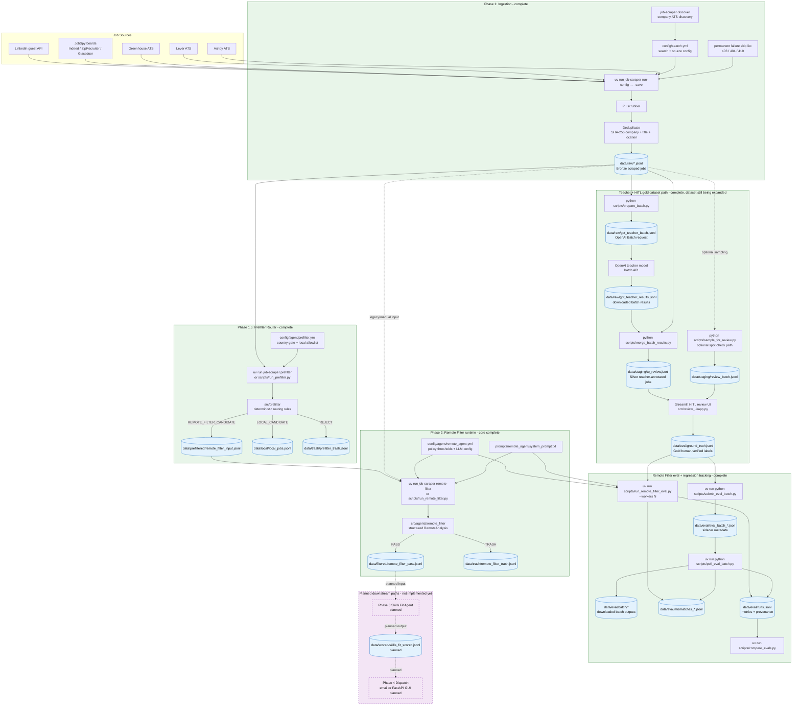

# Data Flow

_Last updated: 2026-05-16_

This diagram reflects the implemented data paths as of today. Phase 3 and Phase 4 are shown as future/downstream targets, but they are not implemented yet.

## Notes

- `data/raw/*.jsonl` is the immutable scrape source truth.
- The prefilter router now splits raw data into a remote-filter candidate bucket, a local bucket, and a prefilter trash bucket.
- Remote-filter production output currently splits records into `data/filtered/remote_filter_pass.jsonl` and `data/trash/remote_filter_trash.jsonl`.
- Eval does **not** read production pass/trash outputs; it reads `data/eval/ground_truth.jsonl`, reruns the agent, and appends metrics/provenance to `data/eval/runs.jsonl`.
- The next planned data path is Phase 3: `data/filtered/remote_filter_pass.jsonl` → Skills Fit Agent → `data/scored/skills_fit_scored.jsonl`.
